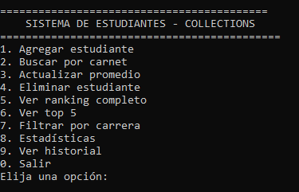
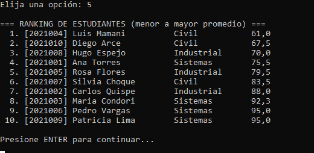
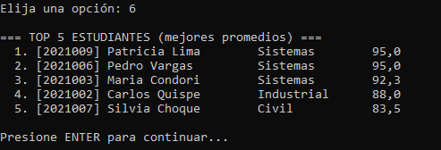

# Semana 4: Sistema de Estudiantes con Collections

##  Descripción
Sistema de gestión de estudiantes que utiliza tres colecciones diferentes del Java Collections Framework, cada una con un rol específico: búsqueda rápida por carnet, ranking automático por promedio e historial de operaciones.

## Tabla comparativa para el README


| Colección | Rol en el sistema | Por qué se usa |
|-----------|-------------------|----------------|
| **HashMap<String, Estudiante>** | Búsqueda de estudiantes por carnet | Permite encontrar un estudiante de forma instantánea usando su carnet como clave |
| **TreeSet<Estudiante>** | Ranking automático de estudiantes | Mantiene los estudiantes ordenados automáticamente por promedio |
| **ArrayList<String>** | Historial de operaciones | Guarda el registro de acciones realizadas en el sistema |


##  Cómo compilar y ejecutar el proyecto.

1. Entrar a la carpeta : ‘cd semana-04-estudiantes-collections‘
2. Compilar : javac Main.java modelo/*.java servicio/*.java
3. Ejecutar : ‘java Main‘

##  Ejemplo de salida del programa

```
==========================================
    SISTEMA DE ESTUDIANTES - COLLECTIONS
============================================
1. Agregar estudiante
2. Buscar por carnet
3. Actualizar promedio
4. Eliminar estudiante
5. Ver ranking completo
6. Ver top 5
7. Filtrar por carrera
8. Estadísticas
9. Ver historial
0. Salir
Elija una opción:
```

##  Capturas
Las capturas de pantalla están en la carpeta  capturas/ e incluyen:

- Menu Principal 





- Ranking completo de estudiantes





- Top 5 mejores promedios



