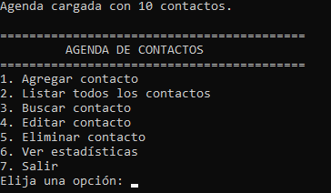
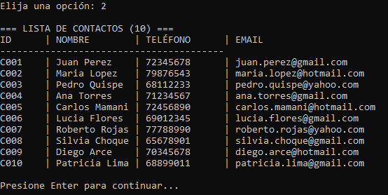
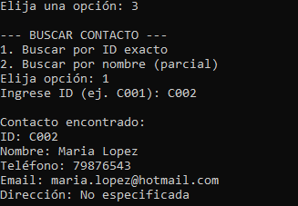
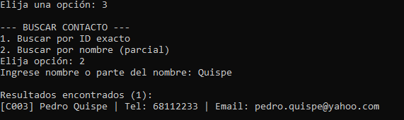
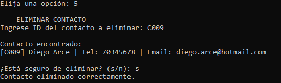
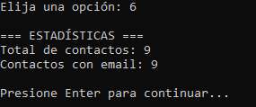

# Semana 5: Agenda de Contactos con Excepciones y Persistencia JSON

## Descripción
Sistema de agenda de contactos que implementa manejo de excepciones personalizadas y persistencia en archivos JSON utilizando la librería Gson. Los datos se guardan automáticamente después de cada operación y se cargan al iniciar el programa.

## Formato JSON que usa el programa
El archivo data/contactos.json almacena los contactos en el siguiente formato:
```
[
  {
    "id": "C001",
    "nombre": "Juan Perez",
    "telefono": "72345678",
    "email": "juan.perez@gmail.com",
    "direccion": "Av. 6 de Agosto 123"
  }
]
```

## Excepciones Personalizadas
```
| Excepción | Tipo | Cuando se lanza |
| DatoInvalidoException | Unchecked (RuntimeException) | Cuando un campo no cumple las validaciones: nombre vacio, telefono con menos de 7 digitos, email sin @ |
| ContactoNoEncontradoException | Checked (Exception) | Cuando se busca un contacto por ID y no existe |
| ContactoExistenteException | Checked (Exception) | Cuando se intenta agregar un contacto con ID duplicado |
```

## Como instalar y ejecutar con MAVEN

1. Entrar a la carpeta : ‘cd semana-05-agenda-contactos‘ 
2. Compilar: mvn compile
3. Ejecutar: mvn exec:java -Dexec.mainClass="Main"

## Validaciones implementadas
- Nombre: no puede estar vacio
- Telefono: entre 7 y 8 digitos
- Email: debe contener el simbolo @
- Direccion: opcional (puede estar vacia)

## Capturas de pantalla






