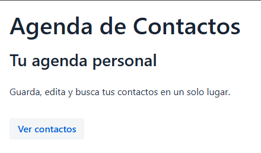
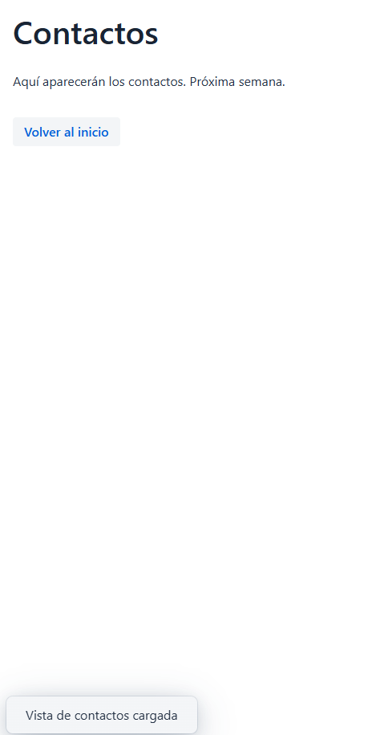

# Semana 7: Agenda Web con Vaadin

## Descripción

Primera aplicación web con Spring Boot y Vaadin. Muestra dos vistas navegables.

## Cómo ejecutar

- 1) Colocar en la terminal: mvn spring-boot:run

- 2) Luego abrir http://localhost:8080

## Vistas

- 1) /: Pagina de inicio con titulo, descripcion y boton a contactos.

- 2) /contactos: Pagina de contactos con mensaje y boton para volver, con una notificacion que aparece y desaparece.

## Capturas

