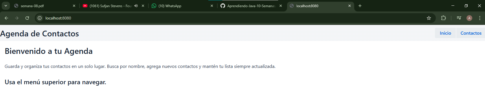
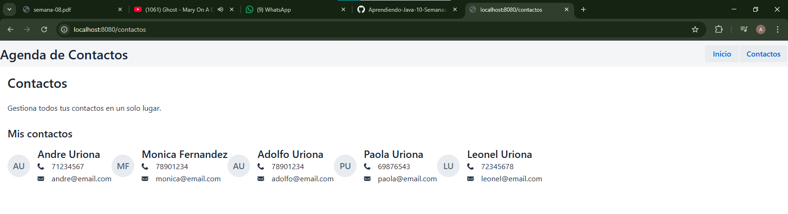

# Semana 8: Agenda Web con Componentes Visuales

## Descripción

Aplicación web con Spring Boot y Vaadin que demuestra el uso de AppLayout, MenuBar, Avatar, Icon y tarjetas personalizadas. Donde esta aplicacion web te permite ver tus contactos, su informacion social.

## Componentes utilizados

- **AppLayout**: Barra superior fija con título y menú
- **MenuBar**: Navegación con RouterLink (Inicio y Contactos)
- **Avatar**: Muestra iniciales del nombre automáticamente
- **Icon**: Iconos de teléfono (PHONE) y email (ENVELOPE)
- **TarjetaContacto**: Clase propia que extiende Div
- **H2, H3, Paragraph**: Jerarquía tipográfica

## Cómo ejecutar

- 1) Entrar a la carpeta: ‘cd semana-08-agenda-web‘

- 2) Compilar: mvn compile

- 3) Ejecutar: mvn spring-boot:run

- 4) Luego abrir http://localhost:8080

## Capturas

- 1) /: Pagina de inicio con titulo, descripcion y boton a contactos.

- 2) /contactos: Pagina de contactos con mensaje y boton para volver, con una notificacion que aparece y desaparece.

