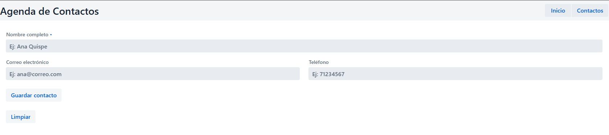
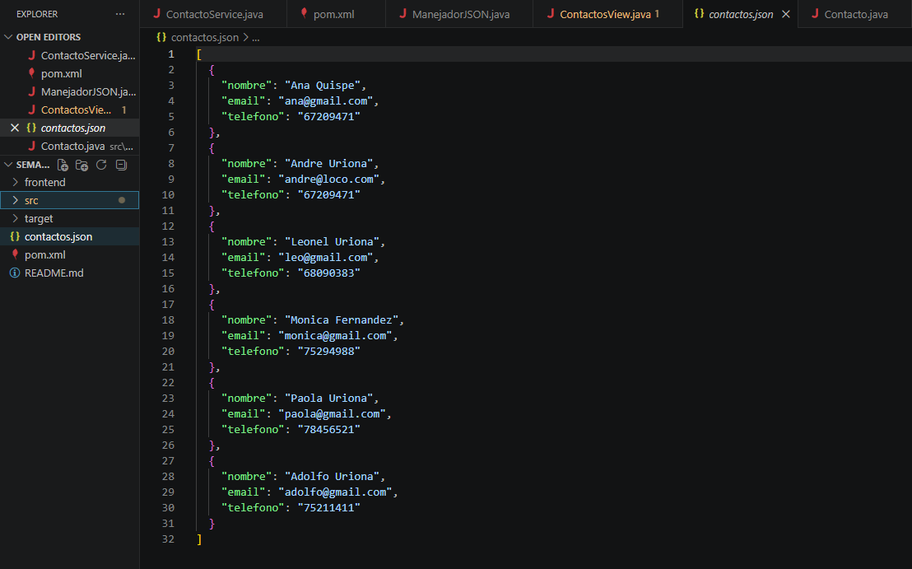

# Semana 9: Agenda Web con Formulario y Persistencia

## Descripción
Aplicación web que permite agregar contactos mediante un formulario con validaciones. Los datos se guardan en un archivo JSON y persisten entre reinicios de la aplicación.

## Arquitectura
```
ContactosView
     |
     v
ContactoService <- @Service
     |
     v
ManejadorJSON <- lee / escribe contactos . json
     |
     v
contactos . json
```


## Componentes utilizados

| Componente | Descripción |
|------------|-------------|
| TextField | Campo para el nombre completo |
| EmailField | Campo para correo electrónico (validación automática) |
| NumberField | Campo para teléfono (solo números) |
| FormLayout | Organiza los campos en dos columnas |
| Binder | Vincula el formulario con el objeto Contacto |
| Button | Botones Guardar y Limpiar |
| Notification | Mensaje de confirmación al guardar |

## Validaciones implementadas

- El nombre no puede estar vacío (validación con `asRequired`)
- El email debe tener formato válido (validación automática de EmailField)

## Persistencia

Los contactos se guardan en el archivo `contactos.json` en la raíz del proyecto. Cada vez que se guarda un contacto, se actualiza el archivo. Al reiniciar la aplicación, los contactos anteriores siguen disponibles.

## Cómo ejecutar

1. cd semana-09-agenda-web
2. mvn compile
3. mvn spring-boot:run
4. Luego abrir http://localhost:8080/contactos 

## Capturas






## Ejemplo de JSON generado

```
{
    {
        "nombre": "Leonel Uriona",
        "email": "leo@gmail.com",
        "telefono"; "68090383"
    }
}
```
