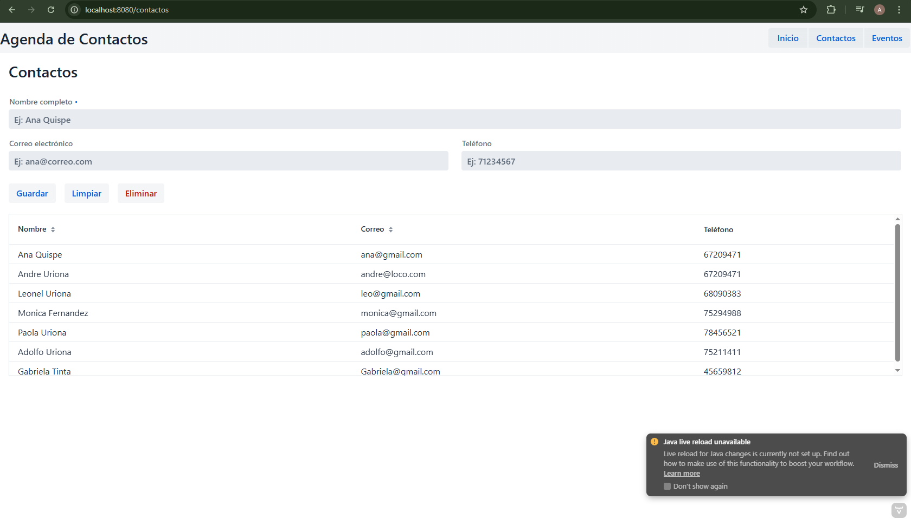
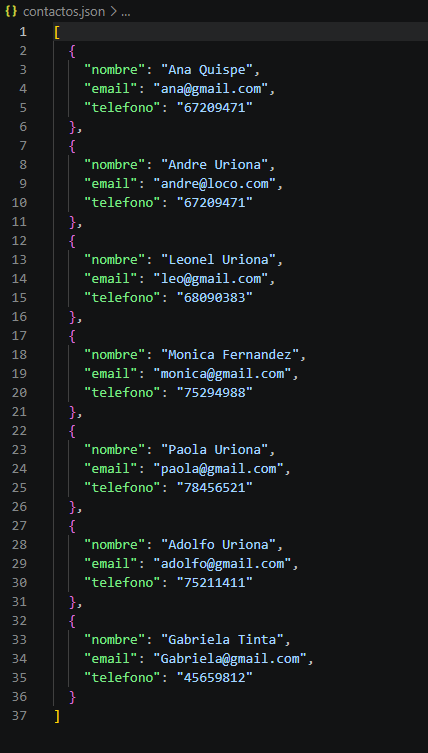
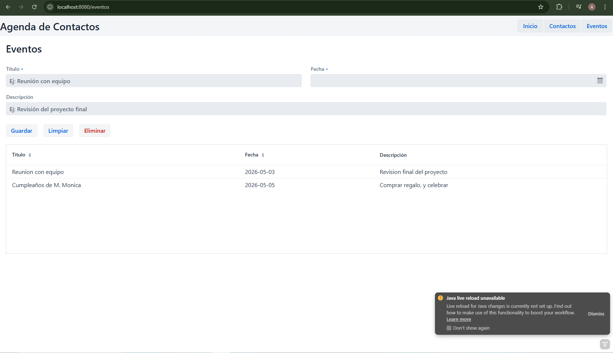
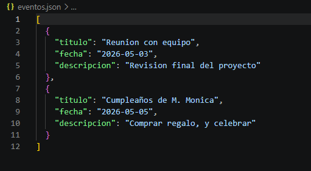

# Semana 10: Agenda Completa - Proyecto Final

## Descripción
Aplicación web completa con dos entidades: Contactos y Eventos. CRUD completo con Grid, formularios, validaciones y persistencia en JSON.

## Arquitectura
```
ContactosView             EventosView
    |                          |
    v                          v
ContactoService        EventoService <- @Service
    |                          |
    v                          v
ManejadorJSON           ManejadorJSON
    |                          |
    v                          v
contactos.json          eventos.json

```


## Componentes utilizados

- **Grid**: Tablas para listar contactos y eventos
- **ConfirmDialog**: Confirmación antes de eliminar
- **DatePicker**: Selector de fecha para eventos
- **FormLayout**: Organización de campos
- **Binder**: Validación y vinculación con modelos
- **@Service**: Inyección de dependencias

## Funcionalidades
- CRUD completo de contactos
- CRUD completo de eventos
- Persistencia en JSON
- Selección en Grid para editar
- Eliminación con confirmación


## Cómo ejecutar

1. cd semana-10-agenda-web
2. mvn compile
3. mvn spring-boot:run
4. Luego abrir: http://localhost:8080/contactos 

## Capturas






## Autor 

Uriona Fernandez Andre Sebastian

